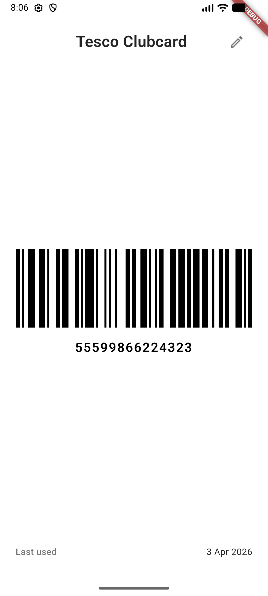

# Card Stash

A clean, local-first loyalty and membership card wallet for iOS and Android.

Built with Flutter. No accounts. No analytics. No network calls. Your cards stay on your device, encrypted.

I built Card Stash because every store card app in the app stores is either stuffed with ads, wants an account, or tracks you across half the internet. I just wanted to scan my loyalty cards, search for them at the till, and sort them by how often I use them. So I built one.

<p align="center">
  
  
  
</p>

---

## Features

- **Live camera scanning** — point at any card to detect barcodes and text in real-time with live overlay
- **On-device OCR** — extracts card name, expiry, and number automatically from the camera feed or photos
- **All major barcode formats** — QR, Code128, Code39, EAN-13, EAN-8, DataMatrix, PDF417, Aztec
- **Full-screen card display** — maximum brightness, correct barcode rendering, card number as fallback
- **Smart sorting** — most used, A-Z, recently used, or newest first; favourites pinned
- **Rename and annotate** — label a card "Susie's Waitrose" and add notes
- **Duplicate detection** — warns when adding a card number that already exists
- **Optional expiry tracking** — notifications at 30 days, 7 days, and on expiry day
- **Light, dark, and system themes** — with custom card colour picker
- **Encrypted at rest** — AES-256 via Hive CE, key stored in device secure enclave
- **Encrypted export/import** — migrate cards between devices with passphrase-based AES-256-GCM encryption
- **Expiry alerts tab** — see all cards with expiry dates sorted by soonest first
- **Payment card rejection** — detects and blocks storage of credit and debit cards

---

## Privacy

Card Stash stores all data locally on your device. There are no servers, no accounts, no telemetry, and no third-party SDKs that phone home.

Your data is encrypted using a 256-bit key stored in your device's secure enclave (iOS Keychain / Android Keystore). If you uninstall the app, your data cannot be recovered.

**Do not use Card Stash to store credit or debit cards.** Use Apple Pay or Google Wallet for payment cards.

---

## Getting Started

### Requirements

- Flutter 3.41+
- Dart 3.11+
- iOS 13+ / Android 6.0+ (API 23+)

### Setup

```bash
git clone https://github.com/BenWhite-git/card-stash.git
cd card-stash
flutter pub get
flutter run
```

### iOS — Camera Permissions

Add the following to `ios/Runner/Info.plist`:

```xml
<key>NSCameraUsageDescription</key>
<string>Card Stash uses the camera to scan loyalty and membership cards.</string>
```

### Android — Camera Permissions

The `camera` package handles camera permissions automatically. No manual manifest changes required.

### Android — Disable Auto-Backup

Add the following to `android/app/src/main/AndroidManifest.xml` to prevent encrypted Hive data being backed up without its key:

```xml
<application
  android:allowBackup="false"
  ...>
```

See [docs/SECURITY.md](docs/SECURITY.md) for full rationale.

---

## Tech Stack

| Concern | Package |
|---|---|
| Local storage | `hive_ce`, `hive_ce_flutter` |
| Encryption key | `flutter_secure_storage` |
| Camera + frame streaming | `camera` |
| Barcode detection | `google_mlkit_barcode_scanning` |
| Barcode rendering | `barcode_widget` |
| Notifications | `flutter_local_notifications` |
| State management | `flutter_riverpod` |
| Image picking | `image_picker` |
| Routing | `go_router` |
| On-device OCR | `google_mlkit_text_recognition` |
| Export crypto | `cryptography` |
| Export share sheet | `share_plus` |
| Import file picker | `flutter_file_picker` |

---

## Roadmap

See [docs/SPEC.md](docs/SPEC.md) for the full product specification and planned future features.

---

## Contributing

Contributions are welcome. Please read [docs/CONTRIBUTING.md](docs/CONTRIBUTING.md) before opening a pull request.

---

## Licence

MIT — see [LICENSE](LICENSE)
